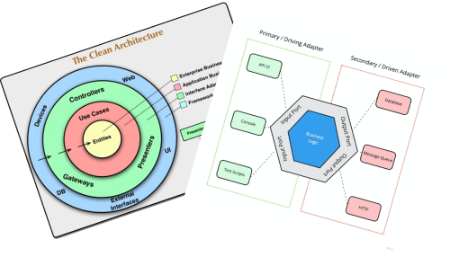
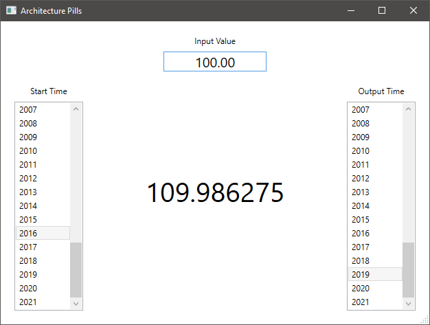

# Overview

If you are a developer, most probably, you like to create applications.
But, what is the architecture that you, usually, create for your applications?

Hi, I am Alex and you are watching Architecture Pills.

In this series of pills I will show you how I started to structure my applications after I've learned about Clean Architecture and Hexagonal Architecture.

I will take, as an example, a desktop WPF application, but the same technics can be applied to any other type of applications: Console, ASP.NET MVC, Razor Pages, Web Service, etc.

[Picture with WPF icon, a Console, the ASP.NET icon, Razor Pages icon, Web services image]

The application that I will build during this series of pills is quite simple, but still complex enough to discuss some interesting approaches regarding architecture and other interesting topics.

My proposal is to implement an application that calculates the equivalent value of an amount of money for a specific year, based on the inflation rates. The inflation rates are known values, read from a storage, a JSON file for example.

One of the most important benefits that I achieved by working as I am about to show you, was the ability to keep a decent development speed over the time. Even after 1 year of work, the code, for the first time in my life, does not feel like a swamp. I can work with fairly the same speed as in the beginning. Which was a great deal for me.

[Picture with an old man that writes code]

You may not always see and feel in this course the need for each change or rule that I am about to present. I wish such situations will be few and I will try to always explain the real experience that I had over the time with real applications, that shaped the way I am writing the code now.

All this being said, let's start the first pill.

