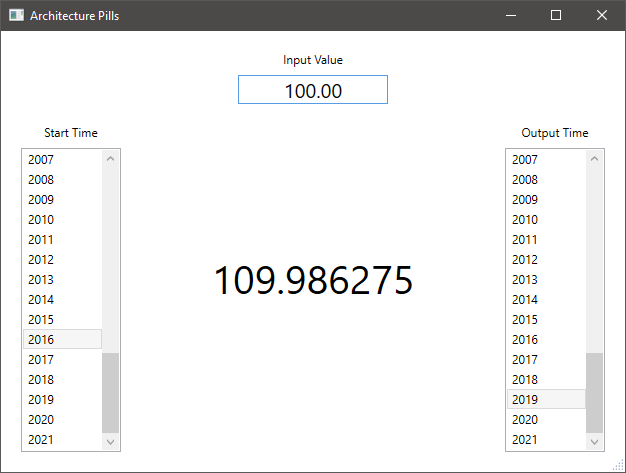
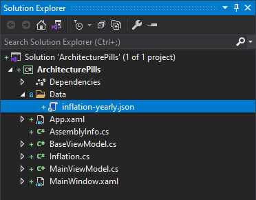
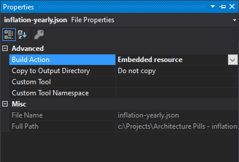
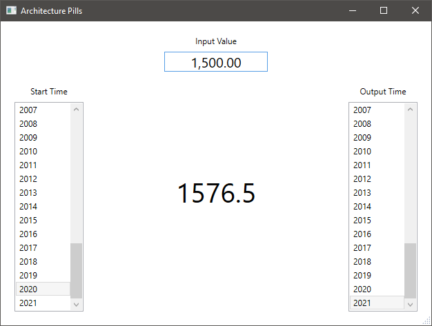

# 01x01 - The monolith application

 - A `TextBox`, two `ListBox`es and a `TextBlock`.

## Description

The proposed application will calculate the equivalent value of a specific amount of money for a specific year, based on the inflation rates.

The user must provide three values:

- The initial amount of money
  - manually provided in the top box.
- The start year
  - chosen from the left list.
- The end year
  - chosen from the right list.



The application will, then, calculate the equivalent value of the amount inserted by the user and will display it in the center of the window.

## Implementation

### Step 1 - Create the View

Let's start with the View.  The `MainWindow.xaml` file must create and display the controls visible in the above screenshot:

```xml
<DockPanel Margin="20">

    <!--
    At the top we place a TextBox for the input value.
    It will accept a float with two decimals.
    -->
    
    <StackPanel
        DockPanel.Dock="Top"
        Orientation="Vertical"
        HorizontalAlignment="Center">

        <TextBlock
            Text="Input Value"
            VerticalAlignment="Center"
            Margin="0 0 0 8"
            HorizontalAlignment="Center" />

        <TextBox
            Text="{Binding InputValue, StringFormat=N2}"
            MinWidth="150"
            HorizontalContentAlignment="Center"
            FontSize="20" />

    </StackPanel>

    <!--
    In the left part, will place the list of years from where
    the user must select the start year.
    -->
    
    <DockPanel
        DockPanel.Dock="Left"
        Margin="0 20 0 0">

        <TextBlock
            DockPanel.Dock="Top"
            Text="Start Time"
            Margin="0 0 0 8"
            HorizontalAlignment="Center" />

        <ListBox
            ItemsSource="{Binding StartTimes}"
            SelectedItem="{Binding SelectedStartTime}"
            MinWidth=" 100" />

    </DockPanel>

    <!--
    In the right part, a similar list of years from which
    the user will select the end year.
    -->
    
    <DockPanel
        DockPanel.Dock="Right"
        Margin="0 20 0 0">

        <TextBlock
            DockPanel.Dock="Top"
            Text="Output Time"
            Margin="0 0 0 8"
            HorizontalAlignment="Center" />

        <ListBox
            ItemsSource="{Binding EndTimes}"
            SelectedItem="{Binding SelectedEndTime}"
            MinWidth=" 100" />

    </DockPanel>

    <!--
    In the middle, a TextBlock will display the calculated value.
    The TextBlock is placed inside a Viewbox that will automatically
    shrink it down when the window is resized.
    -->
    
    <Viewbox
        StretchDirection="DownOnly"
        Margin="20">

        <TextBlock
            Text="{Binding OutputValue}"
            FontSize="40" />

    </Viewbox>

</DockPanel>
```

In the code behind, the constructor will instantiate the View Model:

```csharp
public MainWindow()
{
    InitializeComponent();

    DataContext = new MainViewModel();
}
```

### Step 2 - Properties for binding

Next, let's implement the View Model. It must contain all the proprieties that the View is binding to.

#### The `StartTimes` list

The list of start years displayed to the user and its associated selected value, chosen by the user.

The `StartTimes` list is a get-only property because it will be initialized from the constructor and never changed during the execution of the application.

The `SelectedStartTime` is set the user, so it must provide a setter. On that setter, the application must recalculate the output value, hence the call to the `CalculateOutputValue()` method that will be implemented later.

```csharp
private string selectedStartTime;

public List<string> StartTimes { get; }

public string SelectedStartTime
{
    get => selectedStartTime;
    set
    {
        selectedStartTime = value;
        CalculateOutputValue();
    }
}
```

#### The `EndTimes` list

The list of end years and its selected value is very similar to the start times list:

```csharp
private string selectedEndTime;

public List<string> EndTimes { get; }

public string SelectedEndTime
{
    get => selectedEndTime;
    set
    {
        selectedEndTime = value;
        CalculateOutputValue();
    }
}
```

#### The `InputValue` number

The input value is a float. Same as before, this value is provided by the user, so it needs a setter, and it is used in the calculation of the output value, so, as before, the call to `CalculateOutputValue()` method.

```csharp
private float inputValue;

public float InputValue
{
    get => inputValue;
    set
    {
        inputValue = value;
        CalculateOutputValue();
    }
}
```

#### The `OutputValue` number

The output value is also a `float`, this time nullable, because, if the output value cannot be calculated for any reason, the application must display nothing.

Another important aspect is the fact that this value will be set only by the internal logic of the application and displayed in the view. The user cannot set this value, so the setter is private.

```csharp
private float? outputValue;

public float? OutputValue
{
    get => outputValue;
    private set
    {
        outputValue = value;
        OnPropertyChanged();
    }
}
```

The call to the `OnPropertyChanged()` method is necessary in order to announce the view that a new value is available so that the binding mechanism to read it and display it. This method is raising the `INotifyPropertyChanged.PropertyChanged` event. 

### Step 3 - The `PropertyChanged` event

Usually I implement the `INotifyPropertyChanged` interface and its event in a base class inherited by all my View Models.

The base class:

```csharp
public class BaseViewModel : INotifyPropertyChanged
{
    public event PropertyChangedEventHandler PropertyChanged;

    protected virtual void OnPropertyChanged([CallerMemberName] string propertyName = null)
    {
        PropertyChanged?.Invoke(this, new PropertyChangedEventArgs(propertyName));
    }
}
```

The View Model:

```csharp
public class MainViewModel : BaseViewModel
{
    ...
}
```

### Step 4 - Calculate the output value

For the calculation of the output value the algorithm needs:

- The input value (amount of money)
- The selected start year
- The selected end year

The three associated properties are calling the `CalculateOutputValue()` method that we did not implement yet. Let's do it:

```csharp
private void CalculateOutputValue()
{
    // Find the index of the start year.
    int startIndex = inflations.FindIndex(x => x.Time == selectedStartTime);

    // Find the index of the end year.
    int endIndex = inflations.FindIndex(x => x.Time == selectedEndTime);

    if (startIndex == -1 || endIndex == -1)
    {
        OutputValue = null;
    }
    else
    {
        // Iterate from start index to end index and adjust the calculated value
        // based on the inflation rate of each step.

        float calculatedValue = inputValue;

        if (startIndex < endIndex)
        {
            for (int i = startIndex + 1; i <= endIndex; i++)
            {
                float inflationRate = inflations[i].InflationRate;
                float inflationValue = 1 + inflationRate / 100;
                calculatedValue *= inflationValue;
            }
        }
        else if (startIndex > endIndex)
        {
            for (int i = startIndex; i > endIndex; i--)
            {
                float inflationRate = inflations[i].InflationRate;
                float inflationValue = 1 + inflationRate / 100;
                calculatedValue /= inflationValue;
            }
        }

        OutputValue = calculatedValue;
    }
}
```

### Step 5 - Load the inflation rates

The last thing to do is to load the inflation rates from a storage and initialize the list of years. Ah, and also the input value. Maybe 100 is a good value.

#### Load inflation rates

We can store the inflation rates in a database, but, for this example let's have it in an embedded JSON file.

First, let's create the file:



Its content will be something like this:

```json
[
  {
    "Time": "1972",
    "InflationRate": 0.0
  },
  {
    "Time": "1973",
    "InflationRate": 0.7
  },
  {
    "Time": "1974",
    "InflationRate": 1.1
  },
  
  ...
  
]
```

Then, let's embed it:



Now, let's read it:

```csharp
private readonly List<Inflation> inflations;

public MainViewModel()
{
    inflations = LoadInflations();

    ...
}

private static List<Inflation> LoadInflations()
{
    Assembly assembly = Assembly.GetExecutingAssembly();
    using Stream stream = assembly.GetManifestResourceStream("DustInTheWind.ArchitecturePills.Data.inflation-yearly.json");
    using StreamReader streamReader = new(stream);
    string json = streamReader.ReadToEnd();
    return JsonConvert.DeserializeObject<List<Inflation>>(json);
}
```

```csharp
internal class Inflation
{
    public string Time { get; set; }

    public float InflationRate { get; set; }
}
```


#### Initialize the binding properties

And, the last piece of code for today will initialize the previously discussed properties:

```csharp
public MainViewModel()
{
    inflations = LoadInflations();

    List<string> listValues = inflations
        .Select(x => x.Time)
        .ToList();

    StartTimes = listValues;
    SelectedStartTime = listValues.LastOrDefault();

    EndTimes = listValues;
    SelectedEndTime = listValues.LastOrDefault();

    InputValue = 100;
}
```

### Step 6 - Compile and run

I think we are done. Compile and run the application.

Select a start year, and end year and, optionally, you may enter an input value. The application should automatically display the calculated output value.



## The End

### We did it!

Isn't it? We implemented the whole functionality. From the first lesson. What else could we do next?

If we never need to work in this application ever again, if we do not need to add any new feature or do any maintenance work, than we may say we are done.

But this is rarely true. 

### The application is (almost) always growing

Do you know a real application that never needs any new feature? I always end up adding more and more features. This is true to both commercial application and my own pet projects. If there is a client that uses the application, sooner or later, features are required to be added or bugs to be fixed.

The way the code is written, often, makes the difference between a successful application or a failed one. Indeed there are a lot of other aspects that may influence the success or failure of an application, but the structure of the code, on long term, is a big player.

### Second look over the code

If we look again over the code that we just wrote, we may identify code, having different responsibilities, that is placed in the same component (the only assembly that we have in the project, it is a monolith application) or even in the same class.

#### 1) The data storage

The storage (that JSON file) is placed in the same assembly as the rest of the code and the View Model is loading that data in its constructor.

What happens if we need to provide the inflation data from another source, an external file, a database or a web service? It would be much easier to do that if the presentation layer (that View Model) would be decoupled from the details of accessing the  data.

#### 2) The business logic

Calculating the output value is another responsibility that is useful to be placed in a different component than presentation.

The presentation logic may change for different reasons than that algorithm. Furthermore, that algorithm may be useful to be used in another application, too. It would be useful to have it separate.

#### 3) Domain Component

Uncle Bob is calling this type of logic (the `CalculateOutputValue()` method) critical business logic and he suggests to be placed in the Domain component.

#### 4) Use Cases

Uncle Bob also identifies business logic specific to the application, those use cases that he place them in a component called Application. We will talk about use cases in one of the lessons, too.

#### 5) Presentation

Of course, the Views and View Models can be placed in a separate component called the Presentation.

#### 6) The Bootstrapper

After splitting our monolith application into so many components, somebody must put it back together, isn't it? Somebody must configure the dependencies and display the GUI. That component, I prefer to call it the Bootstrapper, though, Uncle Bob, is calling it the Main component, because it contains the Main method.

### It is not the end

We will continue to discuss about those components:

- How to create them?
- Why do we need them?
- And, when it is useful to create them?

Indeed, splitting the application involves some work. Is it worth to do it? The answer to this question can be provided only after we accumulated a certain amount of experience, in order to know what is useful to do in the beginning that has big probability to help us on long term.

This will be discuss further.